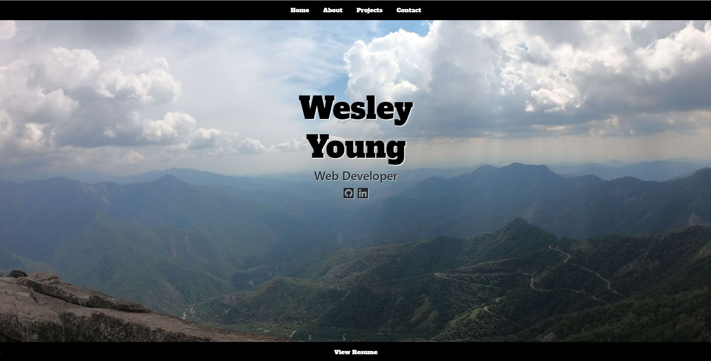

# React Portfolio

## Description

Portfolio page created using react.

## Table of Contents

- [Installation](#installation)

- [Screenshot](#screenshot)

- [License](#license)

- [Links](#links)

- [Questions](#questions)

## Installation

Install necessary dependencies with npm i command.

## Screenshot

## License

Licensed under MIT license.

## Links

https://wyoung60.github.io/reactPortfolio  
https://github.com/wyoung60/reactPortfolio

## Questions

Email wesley.young@du.edu with any questions.
